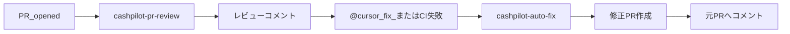

# 自動修正 Automation（レビューと分離）

PR レビュー（コメントのみ）とは別に、**修正 PR を自動作成する** Automation の設定手順です。

## なぜ分離するか

| Automation | 役割 | ツール |
|------------|------|--------|
| `cashpilot-pr-review` | レビューコメントのみ | Comment on pull request |
| `cashpilot-auto-fix` | 指摘や CI 失敗を修正して PR 作成 | Pull request creation, Comment on pull request |

分離することで、意図しない自動修正を防ぎ、コストも抑えられます。



---

## Automation の作成

### 1. 基本設定

| 項目 | 値 |
|------|-----|
| 名前 | `cashpilot-auto-fix` |
| リポジトリモード | Single repository（cashpilot） |
| ベースブランチ | `develop` |

### 2. トリガー

次の **2 つ** を設定します（いずれかが発火すると実行）。

| トリガー | 用途 | フィルタ |
|----------|------|----------|
| **Pull request commented** | PR に `@cursor fix` と書いたとき | コメントに `fix` を含む（正規表現: `@cursor.*fix`） |
| **CI completed** | CI が失敗したとき | 失敗時のみ（設定可能な場合） |

初回は **Pull request commented** のみで動作確認し、CI 連携は後から追加することを推奨します。

### 3. ツール

| ツール | 設定 |
|--------|------|
| **Pull request creation** | 有効 |
| **Comment on pull request** | 有効（元 PR に修正 PR のリンクを残すため） |
| Comment on pull request（承認/変更要求） | 無効 |

### 4. プロンプト

Automation 設定画面の **プロンプト** に以下を貼り付けます。リポジトリの `AGENTS.md`（Agent Instructions）は自動で読み込まれるため、別途入力は不要です。

```markdown
## Goal

cashpilot の Pull Request に対し、レビュー指摘・CI 失敗・明示的な修正依頼を受けて、
自動でコードを修正し、修正 PR を作成する。

## Trigger context

- PR コメントに `@cursor fix` がある場合: 直前のレビューコメントや議論を読み、修正可能な項目を特定する
- CI 失敗の場合: 失敗したチェック（lint / test / build）のログを確認し、原因を修正する

## Fix scope（修正してよいもの）

以下のみ自動修正する:

- lint エラー（ESLint, go vet 相当）
- 型エラー（TypeScript, Go compile error）
- テスト失敗（既存テストの回帰、不足アサーション）
- 単純なバグ（null チェック漏れ、import 漏れ、typo）

## Do NOT fix（修正しないもの）

以下は元 PR にコメントで「手動対応が必要」と報告し、修正 PR は作らない:

- アーキテクチャ変更が必要な指摘
- Phase 5 の新機能実装（画面 API 連携など）
- セキュリティ設計の見直し
- 修正の信頼度が低い場合

## Workflow

1. 元 PR のブランチをチェックアウト
2. 修正対象を特定（レビューコメント / CI ログ）
3. 最小限の diff で修正
4. 検証を実行:
   - `cd frontend && pnpm lint && pnpm test`
   - `cd backend && go test ./tests/unit/...`
5. すべて通ったら修正 PR を作成
6. 元 PR に「修正 PR を作成しました #<新PR番号>」とコメント

## PR policy

- 修正ブランチ名: `cursor/fix-<元PR番号>-5869`
- ベースブランチ: 元 PR のブランチ（元 PR へマージしやすくするため）
- PR タイトル: `fix: address findings for #<元PR番号>`
- PR 本文:
  - 修正した項目の一覧
  - 修正しなかった項目と理由
  - 実行したテスト結果

## Project context

- 手順は `AGENTS.md` に従う
- API 設計は `docs/backend.md` に準拠
- 未実装領域は `docs/implementation-flow.md` Phase 5 を参照
```

---

## 使い方

### パターン 1: レビュー後に手動で修正依頼

1. `cashpilot-pr-review` がレビューコメントを投稿
2. 修正してほしい PR にコメント:

```
@cursor fix
lint エラーとテスト失敗を修正してください
```

3. `cashpilot-auto-fix` が起動し、修正 PR を作成
4. 元 PR にリンクコメントが付く

### パターン 2: CI 失敗時に自動修正

1. PR を push して CI が失敗
2. `cashpilot-auto-fix` が CI ログを読み、修正 PR を作成
3. 修正 PR を元 PR のブランチにマージ、または cherry-pick

---

## 動作確認

### テスト手順

1. わざと lint エラーを入れた小さな PR を作成（例: 未使用 import）
2. レビュー Automation がコメントを付けるのを待つ（またはスキップ）
3. PR に `@cursor fix` とコメント
4. 数分以内に修正 PR が作成されることを確認

### 確認ポイント

- [ ] 修正 PR のブランチ名が `cursor/fix-<番号>-5869` 形式
- [ ] `pnpm lint && pnpm test` が通る状態で PR が作られている
- [ ] 元 PR に修正 PR へのリンクコメントがある
- [ ] アーキテクチャ変更など「修正しない」項目はスキップされている

---

## レビュー Automation との連携

| 順番 | Automation | アクション |
|------|------------|-----------|
| 1 | `cashpilot-pr-review` | PR オープン時にレビューコメント（**変更なし**） |
| 2 | 開発者 | コメントを確認し、自動修正が必要なら `@cursor fix` |
| 3 | `cashpilot-auto-fix` | 修正 PR を作成 |
| 4 | 開発者 | 修正 PR を確認・マージ |

`cashpilot-pr-review` 側は **Pull request creation を無効のまま** にしてください。

---

## トラブルシューティング

| 症状 | 対処 |
|------|------|
| `@cursor fix` しても起動しない | トリガーのフィルタ（`fix` キーワード）を確認。コメントがスレッド内の場合は正規表現フィルタを調整 |
| 修正 PR が作られない | プロンプトの「Do NOT fix」に該当している可能性。Automation 実行ログを確認 |
| 修正が過剰 | プロンプトの Fix scope をさらに絞る（例: lint のみ） |
| 元 PR ではなく develop 向けに PR ができる | プロンプトの「ベースブランチ: 元 PR のブランチ」を強調 |

## 次のステップ

- [Phase 5 向け Automation 設計](./phase5-automations.md) で画面実装の自動化を追加
- CI トリガーの動作確認後、週次実装 Automation を有効化

## 参考リンク

- [はじめの一歩（PR レビュー）](./getting-started.md)
- [Automations ドキュメント](https://cursor.com/docs/cloud-agent/automations)
