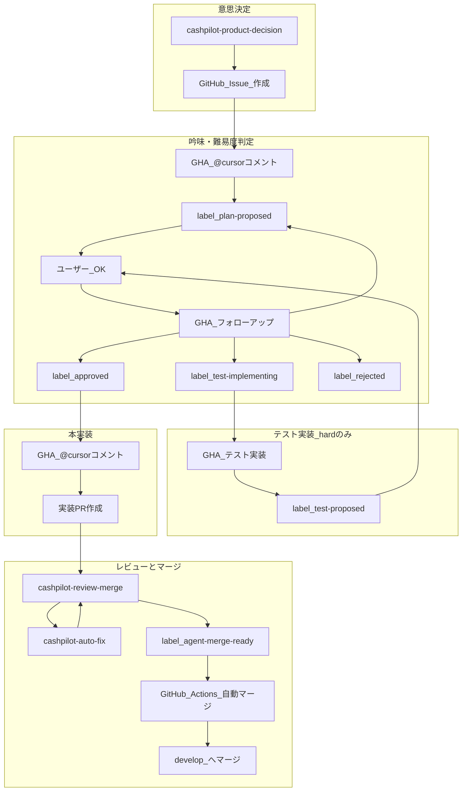

# CashPilot 自立型エージェント組織

CashPilot を「組織」として運用し、意思決定からマージまでをエージェントが担う設計です。
Cursor Automations の制約内で **可能な限り自立** させ、人間は最終オーバーライドのみに限定します。

## 組織図



## 4 つのエージェント

| エージェント | Automation 名 | 役割 | コード変更 |
|-------------|---------------|------|-----------|
| **意思決定** | `cashpilot-product-decision` | バックログ分析、次タスク提案、Issue 作成 | なし |
| **吟味** | GHA → `@cursor` | 実装案の提案、追加入力への対応 | なし |
| **実装** | GHA → `@cursor` | 承認済み Issue を実装し PR 作成 | あり |
| **レビュー・マージ** | `cashpilot-review-merge` | PR レビュー、承認、マージ準備ラベル | なし（修正は auto-fix へ委譲） |

既存の `cashpilot-pr-review` と `cashpilot-auto-fix` は **レビュー・マージ** フェーズに統合または併用します。

## 状態管理: GitHub ラベル

Automations 同士は直接呼び出せないため、**GitHub ラベル** で状態を受け渡します。

| ラベル | 意味 | 付与者 |
|--------|------|--------|
| `agent:proposed` | 要望・タスクの提案（自動または手動） | product-decision / ユーザー |
| `agent:plan-proposed` | 実装案を提示済み、ユーザー入力待ち | deliberation |
| `agent:difficulty-easy` | 難易度: 低（@cursor ok で即本実装） | deliberation |
| `agent:difficulty-normal` | 難易度: 中（具体案確認後に本実装） | deliberation |
| `agent:difficulty-hard` | 難易度: 高（テスト実装経由） | deliberation |
| `agent:test-implementing` | テスト実装中（hard のみ） | test-implementation |
| `agent:test-proposed` | テスト実装完了、確認待ち（hard のみ） | test-implementation |
| `agent:deliberating` | 吟味中（任意・互換用） | deliberation |
| `agent:approved` | 実装承認済み | deliberation |
| `agent:rejected` | 却下 | deliberation |
| `agent:implementing` | 実装中 | implementation |
| `agent:needs-review` | PR 作成済み、レビュー待ち | implementation |
| `agent:merge-ready` | マージ可能 | review-merge |

### ラベルの作成

GitHub リポジトリ → **Issues** → **Labels** で上記ラベルを作成してください。

## 1 サイクルの流れ

### 自動パイプライン（product-decision 起点）

```
1. [cron 週1] product-decision
   → docs/implementation-flow.md を読み、次タスクを Issue に提案
   → ラベル: agent:proposed
   → Issue に `@cursor plan` とコメント

2. [Issue コメント: @cursor plan] GHA → @cursor（難易度判定 + 実装案）
   → 【実装案】難易度: easy|normal|hard
   → ラベル: agent:plan-proposed + agent:difficulty-*

3. [ユーザー追加入力] GHA → @cursor（フォローアップ）
   → easy/normal + @cursor ok: agent:approved
   → hard + @cursor ok: agent:test-implementing → 【テスト実装】→ agent:test-proposed
   → hard + テスト確認後 @cursor ok: agent:approved
   → `@cursor fix plan`: 【修正案】更新
   → `@cursor reject`: agent:rejected

4. [Label: agent:approved] GHA → @cursor（本実装）
   → hard は【テスト実装】を踏まえ修正しながら実装
   → PR 作成、ラベル: agent:needs-review

5. [PR Open（非 Draft）] GHA → @cursor（review-merge）
   → レビュー、問題あれば @cursor fix（auto-fix）
   → 基準を満たせば承認 + agent:merge-ready

6. [Label: agent:merge-ready + CI green] GitHub Actions
   → develop へ自動マージ
```

### 手動 Issue（一言要望・難易度別）

```
1. Issue に一言で要望を書く
2. `@cursor plan` とコメント
3. 【実装案】難易度: easy|normal|hard が付く
3. easy/normal: @cursor ok → 本実装 + PR
   hard: @cursor ok → テスト実装 → @cursor fix or @cursor ok → 本実装 + PR
4. 以降は review-merge → 自動マージ
```

## 完全自立の限界（正直な説明）

Cursor Automations には次の制約があります。

| できること | できないこと |
|-----------|-------------|
| Issue 作成、ラベル付与、PR 作成、PR 承認コメント | Automation から Automation を直接起動 |
| `@cursor fix` による修正 PR | LLM が任意のタイミングで merge ボタンを押す |
| GitHub Actions による条件付きマージ | プロダクト判断の 100% 自動化（人間の価値観は docs に依存） |

**マージ** は Cursor の Automation ツールにはないため、`.github/workflows/agent-auto-merge.yml` で **ラベル + CI 成功** を条件に機械的に実行します。

## セットアップ順序

| 順番 | 作業 | ドキュメント |
|------|------|-------------|
| 1 | GitHub ラベル 12 個を作成（難易度・テスト実装ラベル含む） | 上記表 |
| 2 | Subagent 4 個をリポジトリに追加 | [.cursor/agents/](../../.cursor/agents/) |
| 3 | 意思決定 Automation 作成（**Scheduled**） | [product-decision.md](./agents/product-decision.md) |
| 4 | 吟味・実装の Webhook Automation を **無効化**（残すと GHA と競合） | [triggers-guide.md](./triggers-guide.md) |
| 5 | GHA トリガーワークフローを有効化（`@cursor` コメント経由） | [deliberation.md](./agents/deliberation.md), [implementation.md](./agents/implementation.md) |
| 6 | レビュー・マージの PR トリガー Automation を **無効化**（GHA 経由） | [review-merge.md](./agents/review-merge.md) |
| 7 | GHA レビューワークフローを有効化 | [.github/workflows/agent-trigger-review-merge.yml](../../.github/workflows/agent-trigger-review-merge.yml) |
| 8 | 既存 auto-fix を接続 | [auto-fix-automation.md](./auto-fix-automation.md) |
| 9 | GitHub Actions マージワークフロー有効化 | [.github/workflows/agent-auto-merge.yml](../../.github/workflows/agent-auto-merge.yml) |
| 10 | Approval Policy 確認 | [.cursor/approval-policies/ROUTING.md](../../.cursor/approval-policies/ROUTING.md) |

## Subagent（1 実行内の役割分担）

Automation 1 回の実行内では `.cursor/agents/` の Subagent に委譲します。

| Subagent | 役割 | readonly |
|----------|------|----------|
| `product-planner` | バックログ分析、タスク提案 | はい |
| `architect` | 設計の吟味、トレードオフ評価 | はい |
| `implementer` | コード実装 | いいえ |
| `verifier` | テスト・lint 検証 | はい |

## 人間の関与ポイント（最小化）

| タイミング | 人間がやること |
|-----------|---------------|
| 初回 | ラベル作成、Automation 3 個の設定（product-decision / review-merge / auto-fix）、On-Demand 有効化 |
| 運用中 | `agent:rejected` の Issue を確認（任意） |
| 緊急時 | Automation を無効化、手動マージ |

## 既存構成との関係

| 既存 | 自立型組織での位置づけ |
|------|---------------------|
| `cashpilot-pr-review` | `cashpilot-review-merge` に統合推奨（重複レビューを避ける） |
| `cashpilot-auto-fix` | review-merge フェーズで `@cursor fix` として継続利用 |
| `phase5-automations.md` | implementation エージェントのプロンプトに吸収 |

## 参考

- [Automations ドキュメント](https://cursor.com/docs/cloud-agent/automations)
- [Subagents](https://cursor.com/docs/subagents)
- [Approval Agents](https://cursor.com/docs/approval-agents)
- [Merge Queue](https://cursor.com/docs/cursor-review/merge-queue)
