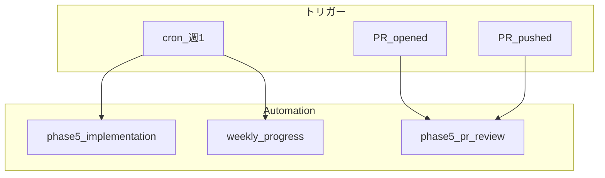

# Phase 5 向け Cursor Automations 設計

CashPilot の Phase 5（フロントエンド画面の API 連携）を加速するための Automation 設計です。
[docs/implementation-flow.md](../implementation-flow.md) の Phase 5 タスクに対応するプロンプトとトリガーを定義します。

## Phase 5 の実装対象

| ID | 画面・機能 | 依存 API | 主なファイル |
|----|-----------|----------|-------------|
| 5-1 | ダッシュボード | user, accounts, transactions, 集計 | `frontend/src/app/(pages)/(dashboard)/`, `actions/dashboard.ts` |
| 5-2 | 口座・カテゴリ設定 | accounts, categories | `frontend/src/app/(pages)/settings/`, `actions/accounts.ts`, `actions/categories.ts` |
| 5-3 | 取引登録・一覧 | accounts, categories, transactions | `frontend/src/app/(pages)/transactions/`, `actions/transactions*.ts` |
| 5-4 | 目標（goals） | goals | `frontend/src/app/actions/goals.ts` |
| 5-5 | シミュレーション | simulation/run | `frontend/src/app/(pages)/simulation/`, `actions/simulation.ts` |
| 5-6 | 設定画面統合 | 上記すべて | `frontend/src/app/(pages)/settings/` |

## Automation 一覧



---

## Automation 1: Phase 5 画面実装（週次）

未実装画面を順に実装する Automation。開発のペースを保つために週 1 回実行します。

### 設定

| 項目 | 値 |
|------|-----|
| 名前 | `cashpilot-phase5-implementation` |
| トリガー | cron: 毎週月曜 9:00（JST に合わせて調整） |
| リポジトリモード | Single repository（cashpilot） |
| ベースブランチ | `develop` |
| ツール | Pull request creation |

### プロンプト

```markdown
## Goal

cashpilot の Phase 5（フロントエンド画面 API 連携）の未実装タスクを 1 件実装し、PR を作成する。

## Priority order

`docs/implementation-flow.md` Phase 5 の順序に従い、未実装の最初のタスクを選ぶ:

1. 5-1 ダッシュボード（残高・今月収支・直近取引）
2. 5-2 口座・カテゴリ設定
3. 5-3 取引登録・一覧
4. 5-4 目標
5. 5-5 シミュレーション
6. 5-6 設定画面統合

既に PR やブランチで作業中のタスクがあればスキップし、次のタスクに進む。

## Implementation rules

- 既存パターンに従う: Server Actions（`frontend/src/app/actions/`）、API クライアント（`frontend/src/app/libs/client.ts`）
- スタイルは SCSS Modules。デザインは `frontend/docs/` を参照
- 画面仕様は `docs/frontend.md` に準拠
- バックエンド API は既に実装済み。フロントの API 連携のみ行う（API 変更が必要な場合は別 PR に分離）

## Verification

PR 作成前に必ず実行:

- `cd frontend && pnpm lint && pnpm test`
- `cd backend && go test ./tests/unit/...`

## PR policy

- ブランチ名: `cursor/phase5-<task-id>-5869`（例: `cursor/phase5-dashboard-5869`）
- ベースブランチ: `develop`
- PR タイトル: `feat(frontend): Phase 5-<ID> <画面名> の API 連携`
- PR 本文に実装した画面・変更ファイル・テスト結果を記載
- 1 PR = 1 Phase 5 タスク（5-1 など）に限定

## Reference

- `AGENTS.md` の手順に従う
- `docs/implementation-flow.md` Phase 5
- `docs/frontend.md` 画面仕様
```

---

## Automation 2: Phase 5 PR レビュー

Phase 5 関連 PR に特化したレビュー Automation。

### 設定

| 項目 | 値 |
|------|-----|
| 名前 | `cashpilot-phase5-pr-review` |
| トリガー | Pull request opened, Pull request pushed |
| フィルタ | ブランチ名に `phase5` を含む、またはラベル `phase5` |
| リポジトリモード | Single repository |
| ツール | Comment on pull request |

### プロンプト

```markdown
## Goal

Phase 5（フロントエンド API 連携）の PR をレビューし、API 連携の正確性と UX を検証する。

## Review checklist

### API 連携

- Server Actions が正しいエンドポイントを呼んでいるか（`docs/backend.md` と照合）
- 認証 Cookie が API リクエストに正しく付与されているか
- エラー時にユーザー向けメッセージが表示されるか
- ローディング状態が適切か

### データ表示

- 金額の符号（収入正・支出負）が正しく表示されるか
- 日付フォーマットが `frontend/src/app/libs/format.ts` の既存パターンに沿っているか
- 空データ時の表示（取引なし、口座なしなど）があるか

### テスト

- 新規コンポーネントに Vitest テストがあるか
- `pnpm lint && pnpm test` が通るか

## Verification

- `cd frontend && pnpm lint && pnpm test`

## Output policy

- コメントのみ（PR 自動作成なし）
- API エンドポイントの不一致は **必須修正** として指摘
- UX 改善は提案レベルでコメント
```

---

## Automation 3: 週次進捗サマリー（Slack）

Phase 5 の進捗をチームに共有する Automation（Slack 連携時）。

### 設定

| 項目 | 値 |
|------|-----|
| 名前 | `cashpilot-weekly-progress` |
| トリガー | cron: 毎週金曜 17:00 |
| リポジトリモード | Single repository |
| ツール | Send to Slack, Read Slack channels（任意） |

### プロンプト

```markdown
## Goal

cashpilot の週次開発進捗を Slack に投稿する。

## Tasks

1. 過去 7 日間にマージされた PR を GitHub から確認
2. `docs/implementation-flow.md` Phase 5 のチェックリストと照合し、完了・未完了を整理
3. 次週の優先タスクを 1 件提案

## Output format（Slack）

```
📊 CashPilot 週次サマリー

✅ 今週マージ: <PR 一覧>
📋 Phase 5 進捗: <完了数>/<全6タスク>
🎯 次の優先: <タスク ID と概要>
```

## Policy

- コード変更・PR 作成は行わない
- 投稿先チャンネル: #cashpilot-dev（設定時に指定）
```

---

## Automation 4: テストカバレッジ追加（PR push 時）

変更ファイルにテストが不足している場合に追加を提案する Automation。

### 設定

| 項目 | 値 |
|------|-----|
| 名前 | `cashpilot-add-tests` |
| トリガー | Pull request pushed |
| リポジトリモード | Single repository |
| ツール | Comment on pull request, Pull request creation（任意） |

### プロンプト

```markdown
## Goal

PR で変更されたファイルに対し、不足しているテストを特定し、必要ならテスト追加 PR を作成する。

## Scope

- フロントエンド: `frontend/src/app/components/` の変更 → `*.test.tsx` を追加
- バックエンド: `backend/internal/logic/` の変更 → `backend/tests/unit/` にテストを追加

## Policy

- 既存テストパターン（`Amount.test.tsx`, `format.test.ts` 等）に従う
- テスト追加のみの PR とし、機能変更は含めない
- テスト追加が不要な場合（ドキュメントのみ等）はコメントで理由を説明
```

---

## 導入の推奨順序

| 順番 | Automation | 理由 |
|------|------------|------|
| 1 | Phase 5 PR レビュー | [はじめの一歩](./getting-started.md) の PR レビューに慣れた後、Phase 5 特化版に差し替え |
| 2 | テストカバレッジ追加 | PR push 時の品質担保 |
| 3 | Phase 5 画面実装（週次） | 自動実装はコストがかかるため、レビュー Automation の動作確認後に有効化 |
| 4 | 週次進捗サマリー | Slack 連携が必要なため最後 |

## 安全な有効化

1. すべて **Comment on pull request のみ** で 1 週間運用
2. 問題なければ **Pull request creation** を Phase 5 画面実装に限定して有効化
3. 週次 Automation の cron は最初は月 1 回に設定し、コストを確認してから週次に変更

## 参考

- [セットアップガイド](./setup-guide.md)
- [はじめの一歩](./getting-started.md)
- [implementation-flow.md](../implementation-flow.md) Phase 5
